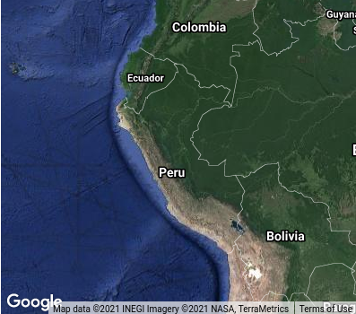

# Primefaces GMap

## Atributos

### Requeridos

El componente GMap de Primefaces requiere de cuatro atributos principales para ser insertado en una página (JSF).

| Atributos | Tipo      | Descripción
| ---       | ---       | ---
| center    | String    | Define la coordenada central del Mapa.
| zoom      | Integer   | Define el nivel inicial del zoom del Mapa.
| type      | String    | Define el [tipo de Mapa](https://developers.google.com/maps/documentation/javascript/maptypes#BasicMapTypes) que se mostrará.
| style     | css style | Es necesario definir el high y width del Mapa.

#### Ejemplo

Código XHTML:

~~~xhtml
<p:gmap styleClass="map-basic" type="hybrid" center="-9.189967,-75.015152" zoom="4"/>
~~~

Resultado:

### Scroll Wheel

Este atributo nos permite habilitar / deshabilitar el _scroll_ para hacer zoom en el Mapa.

#### Ejemplo

Código XHTML:

~~~xhtml

<p:gmap styleClass="map-basic" type="hybrid" center="-9.189967,-75.015152" zoom="4" scrollWheel="false"/>
~~~

Resultado:

### Draggable

Este atributo nos permite habilitar / deshabilitar la posibilidad de arrastrar el Mapa con el mouse.

Code XHTML

~~~xhtml

<p:gmap styleClass="map-basic" type="hybrid" center="-9.189967,-75.015152" zoom="4" draggable="false"/>
~~~

Resultado

### Disable Double Click Zoom

Este atributo nos permite habilitar / deshabilitar la posibilidad de hacer __zoom__ realizando dos clicks seguidos con
el mouse en el Mapa.

Code XHTML

~~~xhtml

<p:gmap styleClass="map-basic" type="hybrid" center="-9.189967,-75.015152" zoom="4" disableDoubleClickZoom="true"/>
~~~

Resultado

### Map Type Control

Este atributo nos permite habilitar / deshabilitar el control para cambiar el tipo de Mapa.

Code XHTML

~~~xhtml

<p:gmap styleClass="map-basic" type="hybrid" center="-9.189967,-75.015152" zoom="4" mapTypeControl="false"/>
~~~

Resultado

### Disable Default UI

Este atributo nos permite habilitar / deshabilitar los controles que vienen por defecto en el Mapa.

Code XHTML

~~~xhtml

<p:gmap styleClass="map-basic" type="hybrid" center="-9.189967,-75.015152" zoom="4" disableDefaultUI="true"/>
~~~

Resultado

### Street View

Este atributo nos permite habilitar / deshabilitar el control para poder navegar por medio de las calles en el Mapa.

Code XHTML

~~~xhtml

<p:gmap styleClass="map-basic" type="hybrid" center="-9.189967,-75.015152" zoom="4" disableDefaultUI="true"
        streetView="true"/>
~~~

Resultado

### Navigation Control

Este atributo nos permite habilitar / deshabilitar el control de navegación en el Mapa.

Code XHTML

~~~xhtml

<p:gmap styleClass="map-basic" type="hybrid" center="-9.189967,-75.015152" zoom="4" navigationControl="false"/>

~~~

Resultado

### Fit Bounds

Este atributo si está habilitado automáticamente se encargara de calcular el atributo _zoom_ y _mapCenter_ del Mapa para
que pueda mostrarse todos los _Markers_ agregados.

Code XHTML

~~~xhtml

<p:gmap styleClass="map-basic" type="hybrid" center="-9.189967,-75.015152" zoom="4" model="#{basicC.defaultModel}"
        fitBounds="true"/>
~~~

Code Java

~~~java

@Named("basicC")
@SessionScoped
public class BasicController implements Serializable {
    private final DefaultMapModel defaultModel = new DefaultMapModel();

    private BasicController() {
    }

    @PostConstruct
    void init() {
        LatLng peruLatLng = new LatLng(-9.189967, -75.015152);
        LatLng boliviaLatLng = new LatLng(-16.290154, -63.588653);
        LatLng ecuadorLatLng = new LatLng(-1.831239, -78.183406);
        LatLng venezuelaLatLng = new LatLng(6.42375, -66.58973);

        Marker peruMarker = new Marker(peruLatLng, "Perú");
        Marker boliviaMarker = new Marker(boliviaLatLng, "Bolivia");
        Marker ecuadorMarker = new Marker(ecuadorLatLng, "Ecuador");
        Marker venezuelaMarker = new Marker(venezuelaLatLng, "venezuela");

        defaultModel.addOverlay(peruMarker);
        defaultModel.addOverlay(boliviaMarker);
        defaultModel.addOverlay(ecuadorMarker);
        defaultModel.addOverlay(venezuelaMarker);
    }

    public DefaultMapModel getDefaultModel() {
        return defaultModel;
    }
}
~~~

Resultado

## Eventos

## Referencias

* [w3schools - Google API Tutorial. (2021, Apr. 25)](https://www.w3schools.com/graphics/google_maps_intro.asp)
* [Google Developers - Maps JavaScript API. (2021, Apr. 20)](https://developers.google.com/maps/documentation/javascript/overview)
* [Primefaces - GMap Documentation. (2021, Apr. 24)](https://primefaces.github.io/primefaces/10_0_0/#/components/gmap)